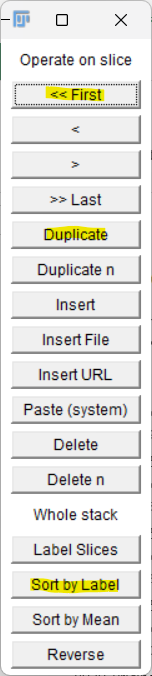
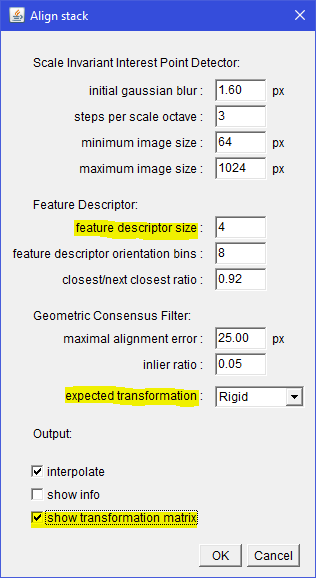

# Calcium Imaging Data Registration

<font size="2"> __Last Updated:__ April 10, 2025

### Conversion
The AVI files written by the 1P AOSLO can cause problems for the registration software and need to be re-written first. In MATLAB, use `convertAviDual` to rewrite the videos:
```matlab
% Arguments: experiment folder, video IDs to convert
convertAviDual("..\MC00851_20250403", 2:14);
```
This also checks for and corrects situations where the length of the "ref" and "vis" videos differ by a few frames.

### Registration
Use the newly converted AVI files ("0" appended to the end) for registration
1. Open Qiang’s registration software
2. Open "Setup" on the toolbar and click "System Parameters". Make sure the GPU is recognized, if you have one. Default settings for the other parameters that work well for our videos:
   - Max lines for NCC = 50
   - Max motion allowed = 200
   - Max row # for NCC = 27
   - Max col # for NCC = 27
   - Number of lines per strip = 64
   - Number of strips = 15
   - Pre-processing filter = 3 x 3 Gaussian
   - Min overlap in = percentile
   - Corr coefficient = 0.75
   - Min overlap for ave = 0.00
   - Check output log image
   - Check rotate scanning rasters 90 degrees
3. Check “Save frames” and “Save all” for Frame and Strip registration
4. Check “2nd NCC” for Strip Registration
5. Drag reflectance video into software (bottom left panel)
6. If you used a reference image, check “Use reference image” and load (will be the one in “Ref” folder that ends with “linear”). If not, check “Auto Ref”
7. Check “Second video” and load the corresponding .avi corresponding to the reflectance video from the step above from the “Vis” folder
8. Run the registration

I check the registration with a reference image on the first and last videos before proceeding with registering all the data. The main goal is to not have strips dropped in the calcium imaging region.

Once you are happy, you can press "Add to Batch" instead of "Run" and cue up the remaining videos to register sequentially. The next step will process the most recently registered video so it's fine to leave multiple copies of a registered video in the file, as long as the most recent one correct for each trial.


### ImageJ-MATLAB
Now we process the registered videos to extract the useful information and create a record of the relevant data that is fast to load into MATLAB and takes up a minimal amount of the computer's memory. This pipeline also serves as the foundation for segmentation and a secondary registration to correct small offsets that arise when registering a full experiment to a single reference image.

There is some overlap between this guide and [PreprocessingDemoV2.m](https://github.com/sarastokes/facile-tools/blob/master/PreprocessingDemoV2.m) which covers the MATLAB code more extensively.

I create a separate MATLAB script for processing each experiment. Begin with the experiment directory (`experimentDir`; folder containing "Ref" and "Vis") and the IDs of the videos you want to process (`epochIDs`) and the experiment date in YYYYmmDD format (`exptDate`).

```matlab
% Define experiment-specific variables
experimentDir = 'C:\..\MC00851_20220614';
epochIDs = [5:10, 15, 17:20];
exptDate = '20220614';
```

Running `processVideoPrep` collects the relevant parameters and file names needed for the main ImageJ-MATLAB routine. See the code comments for more information on the available parameters. The optional parameters below are the most important:
- __ImagingSide__: which side you imaged on. This determines how the video is cropped. If you used the full field of view, set this to 'full'.
- __ImageSize__: the pixel size of the videos (you can drag an avi or tif file from the experiment into ImageJ and find the size in the white info bar at the top of the image)
- __Registration__: frame or strip registration. I generally use strip registration unless there was a reason not to - e.g., difficulties with dropped strips.

ImageJ-MATLAB only runs in the base workspace (scripts, no functions or classes). The next part will be a script that assumes variables named `videoNames` and `p` will be in the base directory, so don't change the variable names

```matlab
[videoNames, p] = processVideoPrep(experimentDir, epochIDs,...
    'ImagingSide', 'right', 'ImageSize', [360 496],...
    'Registration', 'strip');
```
You might get some warnings for epochs that have more than one registered video or no registered videos. If you are missing any registered videos, register them or remove the ID. If you have more than one, the most recent will be used by default. If you need to use the first registered video instead, see the `UseFirst` optional input to `processVideoPrep`.

Next run the ImageJ routine `ProcessFunctionalImagingData.m`. This will first create an "Analysis" folder in the experiment folder (if it doesn't exist already) and 3 subfolders: "Snapshots", "Plots", "Videos".
Then it processes each video. You can watch the processing as it occurs in the MATLAB ImageJ window:
- Each registered AVI file is opened in ImageJ
- If the ImagingSide parameter was not 'full', the region without data will be cropped out.
- The file will be saved as a TIF file in "Videos"
- 3 Z-projections will be created and saved as PNG files in the "Snapshots" folder
- All the new files and the original AVI file are closed

```matlab
run('PreprocessFunctionalImagingData.m');
```

### Creating summary stacks
Go to the "Snapshots" folder inside the "Analysis" folder. Select all the images starting with "SUM" (except background noise trials which can be omitted from these steps). Drag them into ImageJ, then click the "Stk" button on the toolbar and choose "Images to Stack". Open the "Stack Sorter" and click "Sort By Label".
Scrolling through the images, you will see small offsets between them despite having been registered to the same reference image. The section below applies a secondary registration to fix these offsets.

 

### SIFT Registration
Scroll through the SUM stack and choose an image that is well-centered and in the middle of the intensity range (not significantly dimmer than other images in the stack). In the "Stack Sorter" window, press "Duplicate" to create a copy of that image within the stack and "First" to move it to the first image in the stack. This will be the reference image.

Run the "Bleach Correction" plugin and choose the "Histogram Matching" option. This creates a new stack with _DUP appended to the file name. This matches the histograms of each image so that the SIFT registration can focus on comparing features and not be tricked by intensity differences.

Before continuing, confirm that your images are sorted by label (open "Stack Sorter" and press "Sort By Label") and clear the contents of the Log window, if it is open (it should be after Bleach Correction). Using the newly created stack, run "Linear Stack Alignment with SIFT". The default parameters are usually fine, but here are some to keep an eye on:
- __Show transformation matrix.__ This must be checked to record the transforms in the Log window.
- __Expected transform.__ I often try "translation" first for expected transform because it is the most faithful to the original data. Generally I need to rerun it after seeing the aligned images with "rigid". Don't use "affine" - the outputted transforms are not currently compatible with the MATLAB code.
- __Feature descriptor size.__ The default value of 4 generally works well. For smaller fields of view, or when I am having trouble getting a good alignment, increasing this to 8 often helps.


Run the SIFT alignment, then scroll through the newly created stack named "Aligned" and confirm the registration was effective in removing the offsets. The details of the registration are in the ImageJ log window. Right click and Save this as a txt file in the "Analysis" folder. I usually name mine starting with the experiment name (e.g., monkeyID_eye/region_date), then the registration type (e.g., rigid), then the ID of the reference image used: `851_OSR_20220614_rigid_ref0011.txt`


### Create MATLAB object
See the instructions in [PreprocessingDemoV2.m](https://github.com/sarastokes/facile-tools/blob/master/PreprocessingDemoV2.m) for MATLAB object creation and the steps for adding the output of the SIFT transform and recreating your snapshots and SUM/STD stacks.

### Segmentation
See the "Segmentation" section of the [Pipeline documentation](CalciumImagingAnalysisPipeline.pdf) which covers general techniques and the specifics of using the Roi Manager in ImageJ. Importing the ROIs to the MATLAB object is covered in [PreprocessingDemoV2.m](https://github.com/sarastokes/facile-tools/blob/master/PreprocessingDemoV2.m). You can reload the ROIs from the MATLAB object at any point so you do not need to segment the full experiment before checking your data.

