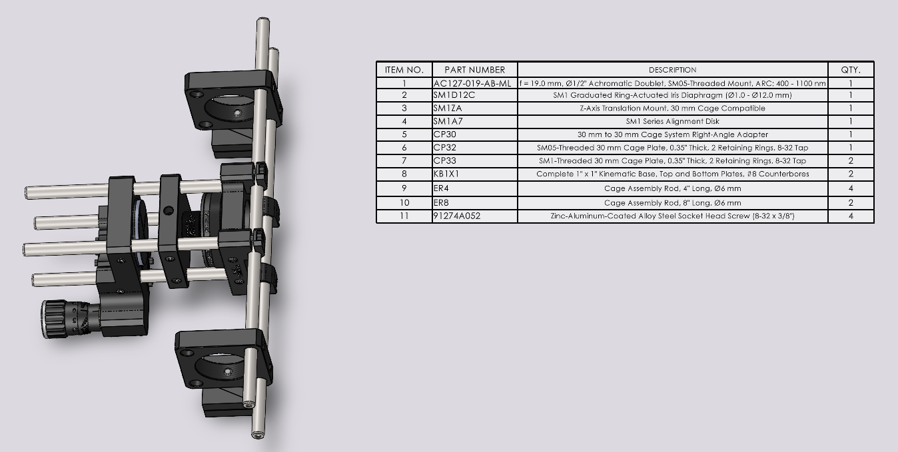

# Marmoset Relay Alignment

__Last Updated:__ April 16, 2025

The marmoset AOSLO relay is an extension of the existing AOSLO and uses the [AO Calibration](AO_Calibration.md) determined with the macaque model eye. The relay consists of 5 mirrors: a magnetic-mounted 2" flat, another 2" flat, a 2" curved mirror (M9), a 3" flat, and a 3" curved mirror (M10).

__Step One: Mirror alignment.__ Use the laminated circle targets in the AOSLO Alignment box.
- Remove the pellicle beamsplitter from its magnetic mount
- Place the 2" flat onto the larger magnetic mount in front of the last flat
    - _Warning_: the top adjuster on the kinematic mount comes very close to touching the last flat, be careful when placing the mirror onto the magnetic mount.
    - The beam will not be centered on the magnetic mounted flat. Don't move the last flat of the main AOSLO to center the beam!
- Align to the second flat of the marmoset relay by adjusting the magnetic-mounted flat
- Align to M9 by adjusting the second flat
- Align to the third flat mirror by adjusting M9
- Align to M10 by adjusting the third flat mirror

__Step Two: Align to the model eye's pupil.__ The exit path is not parallel with the optical table (4 degree angle) nor perpendicular to the edge of the table (~15 degrees). This makes the correct pupil plane a bit tricky to find, so we align the exit path to a magnetic-mounted model eye rather than aligning the model eye to the AOSLO. There is room for improvement in this approach.
- Place the magnetic mounted model eye onto the two posts on either side of the XYZ stage
- Close the iris and align to the center by adjusting M10.
- Turn on the wavefront sensing source. Open TsunamiWave on the AO PC, load the most recent AO calibration and start wavefront sensing ("SHWS" tab, "WS Live")
- Use wavefront sensing spots to fine-tune the alignment of M10.
  - Increasing and decreasing the model eye's iris is helpful
- Set the iris to fill the wavefront sensor and close the loop ("AO" tab, "AO Live")

__Step Three: Image the model eye.__
- Turn on the reflectance source and image the model eye with the SLO software to check the image quality.
- Vary the defocus control on the Tsunami Wave software in 0.01 D increments to identify the best location (look at mean pixel value, image clarity, and uniformity of illumination). The marmoset relay is not perfectly afocal, so 0.08 typically produces the best image quality

__Step Four: Mark the pupil plane with the red and green alignment lasers.__ The intersection of these two lasers will be used for finding the pupil plane in an experiment, setting up the stereotax, and placing power meters and spectrometers.
- Close the iris on the model eye again so that you can see the position of the visible laser from the AOSLO on the front
    - Useful to decrease the entrance pupil iris for the Toptica
- Turn on the two post-mounted alignment lasers
- Adjust the kinematic mounts for the two lasers so that they overlap with the AOSLO laser

__Step Five: Restore standard system parameters__
- Open the model eye iris again to fill the wavefront sensor
- Remember to open the Toptica entrance pupil back to 10 if you decreased it.

__Next:__ Optimize the PMT and source positions, if needed.

