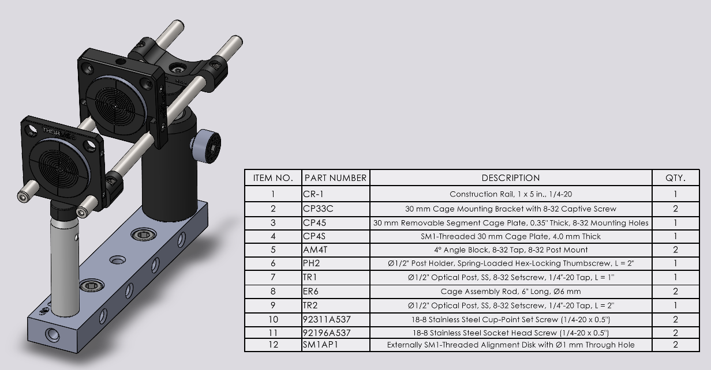

# Marmoset Stereotax Alignment

__Step One:__ Setup
- Turn the system on (especially scanners, DM, and Toptica).
- Turn on the alignment lasers marking the marmoset pupil plane position.
- Open the visible shutter and turn on the Toptica 561 nm line.
- Make sure the DM is flat (if you were previously using AO, go to the "WC" tab and click "Reset").
- Remove the magnetic mount plate from the stereotax base
- Loosen the clamps around the stereotax base so that they slide away, but are not freely movable.

__Step One:__ Place the alignment guide.
- Move the X, Y and Z micrometers to the center of their range (6.5 mm). Adjust the pitch on the PY004 pitch/yaw stage to be flat (use bubble tool) and the rotation to the center of its range.
- Place the alignment guide on the top of the PY004 pitch/yaw stage and screw two 1/4-20" x 0.5" cap screws into the 3rd and 5th holes of the stage, so that the first post is centered over the yaw center of the PY004 stage.
  - It's important this lines up perfectly parallel with the sides of the stereotax base (perpendicular to pupil plane and front of stereotax base). Place both screws before tightening them all the way.
- Add cage plates with alignment targets to the front and back of the cage.
  - The front target should be on a thin 30 mm cage plate (e.g., CP4S) flush against the CP33 post-mount bracket.

__Step Two:__ Adjust the position of the stereotax base.
- Use the alignment lasers to position the first alignment target at the pupil plane.
  - For moving left/right and forwards/backwards, move the whole base (not the micrometers on the 562-XYZ stage as these should remain centered).
  - It's fine to use the height micrometer - each component of the stereotax has a fixed height.
- Rotate the stereotax base (the whole thing, not the yaw micrometer on the PY004 stage) until the beam is centered on the 2nd alignment target. Ignore the alignment lasers' position on the 2nd target and only optimize the Toptica. During this, keep an eye on where the pupil plane is on the first alignment target so that you are mainly adjusting rotation around the pupil plane.
  - The rotation (left/right on 2nd alignment target) is the primary goal here, if the pitch of the beam is off, it's okay.
- Push the first clamp up against the base and tighten (I usually start with the two at the front, but it's up to you).
  - Press down on the stereotax base to keep it from moving when positioning the clamps.
- Continue placing the clamps while keeping an eye on the alignment targets to ensure you aren't moving the stereotax base
- The final clamp is the silver Newport clamp that should go on top of the stereotax base at the bottom right. This one keeps the base from lifting up.

Stereotax rotation alignment guide. The 2nd alignment target is on a drop-in cage plate and can be moved to the back of the extension rods to fine-tune the stereotax rotation.