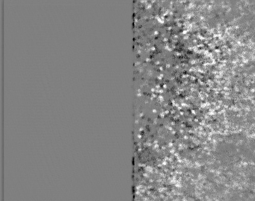

## Maxwellian View Coalignment with AOSLO

 __Last Updated:__ April 21, 2024

> _If the stimulus has uniform chromaticity before the pellicle but not after, get a new pellice ([ThorLabs BP208](https://www.thorlabs.com/thorproduct.cfm?partnumber=BP208))._

### Positioning the stimulus within the FOV
This relies on a series of near/far-field alignments. We typically image on one side of the FOV and provide stimuli on the other side, so the goal is to place the stimulus to the left or right. Making the correct determination on stimulus position is easiest if you have a specific imaging region or stimulus/imaging layout in mind.

1. Center the stimulus on L4.
   - Hold a card or lens paper after the 2nd flat mirror and adjust the first flat to center the beam.
   - Hold the card/paper near the final lens and adjust the 2nd flat mirror to center it on the lens
   - Iterate.
2. Position the beam within the FOV.  _Note: the stimulus will no longer pass through the center of L4. This hasn't been an issue with the small displacements we typically use but could be fixed in the future with the addition of another flat to provide an additional degree of freedom._
    - Turn on the 488 nm laser and set the FOV to whatever size you plan to use for physiology. Adjust the laser intensity to ensure the Maxwellian View stimulus is visible. I usually use just the red LED for this step.
    - Hold a card at the final flat and compare the size of the stimulus to the 488 nm FOV. If the stimulus is too large or too small, make a coarse adjustment to the iris between F1 and F2. There will be an opportunity to make finer adjustments to stimulus size later.
    - Hold a card against the final flat of the AOSLO and adjust F2 to position the beam to the left/right of the FOV formed by the 488 nm laser.
    - Hold the card at the aperture of the model eye and adjust the pellicle to position the beam to the same position within the FOV. Also check when the card is further back (e.g., turn off lights and look at projection on wall).
    - Iterate.
3. Confirm position by imaging the stimulus in the model eye.
    - Remove any fluorescence filters from in front of the visible PMT. This step is also easier if you remove any NDFs in the Maxwellian View.
    - Turn all three LEDs up (use CW setting) and turn the 488 nm laser off (extent is determined by the FOV you're imaging with, so we know it would fill the image). The room lights should also be turned off.
    - Turn up the visible PMT gain (may need to be quite high; 0.8-0.9). You should at least see increased noise in the region where the stimulus is present
    - Take a 10-20 second video, drag into ImageJ and take the Standard Deviation z-stack of the video which will reveal the stimulus even if it wasn't very visible in an individual frame.
     - Make fine adjustments to stimulus size, if needed, using the iris between F1 and F2.
4. Iterate the two previous steps if the model eye position wasn't ideal. On the side where the stimulus borders the imaging region, I focus on on ensuring there is no overlap between the imaging region and the stimulus. On the other side, at the edge of the FOV, I often let the stimulus run past the edge of the FOV a little to ensure stimuli reach the full fovea.

### Empirical confirmation of alignment during an experiment

The Maxwellian view spot should be fully covering the receptive fields of the RGCs being imaged. After alignments or in new imaging areas this sometimes doesn’t happen and requires some extra work to get right. The problem with having it off-center isn’t just that some ROIs don’t get the stimulus – it’s that the edge of the Maxwellian view spot moves across the retina with the residual eye movements and that’s a good stimulus for RGCs – you will need to omit all ROIs anywhere near the edge so mitigating this is good to get the most data.

The stimulus position in the model eye should be a good reference (see pre-experiment optimization protocols), but absolutely needs to be confirmed after alignments, in new imaging regions or when using new FOV sizes. I check in the model eye before each experiment (usually identifies times when pellicle has been bumped) and while running basic stimuli as described below.

These steps use the custom `stimResponseMap.ijm` macro for ImageJ which can be found in my [imagej-tools](https://github.com/sarastokes/imagej-tools) repository.

1. __Coarse alignment and system validation.__
    - Run the intensity increment.
    - Register the video and drag it into ImageJ.
    - Run the ImageJ macro and use the dialog box to ensure the stimulus frames are correct (for the standard intensity increment, it should be 500-750 frames).
    - You should clearly see the responsive cells in the resulting onset map (almost all respond to this intensity increment in some way)

1. __Fine alignment to fully center stimulus and remove edges.__
    - Run the "LightsOn" step stimulus which gives the cells time to adapt to a new light level. Then run the "Baseline" stimulus.
    - Drag the _unregistered_ fluorescence video into ImageJ
    - Run the ImageJ macro and set the stimulus frames to something like 500-1500.

__Diagnosing misalignments by imaging the stimulus:__ If you find the stimulus position does not match that in the model eye, you can get some valuable information on what might be wrong (misalignment or are you just not hitting the RGCs' receptive fields) by trying to figure out where the stimulus actually is. To image the stimulus itself:
  - Remove any NDFs, but leave the diffuser on if possible.
  - Close the visible shutter and make sure "Manual Ctrl" is checked so the shutter doesn't open automatically when you start imaging.
  - Record a 60 minute long video.
  - Drag the unregistered video into ImageJ and calculate a Z-projection, choose the Standard Deviation option.
  - If the stimulus is in the FOV, it should now be visible.

__Quick fixes__: First adjust the pitch/rotation of the cart to attempt to better align the stimulus with the RGCs' receptive fields as this will not alter your calibration. Anything more than small adjustments of the FOV position indicates a larger problem that should be addressed offline. If you want to get some test data and are okay with alterations to the stimulus characteristics from the calibrated values, first try opening the aperture after the first flat mirror a little bit (too much and it will easily cover the full FOV). This often fixes the issue, but you may have some overlap between the stimulus and the imaging region and the amount of light will change. Adjusting mirror or the pellicle will change your calibration more significantly - we have done it before _in vivo_ by imaging the stimulus, but I wouldn't recommend it.

__Next__: [LED Spectra Calibration](LED_Spectra_Gamma_Calibration.md)