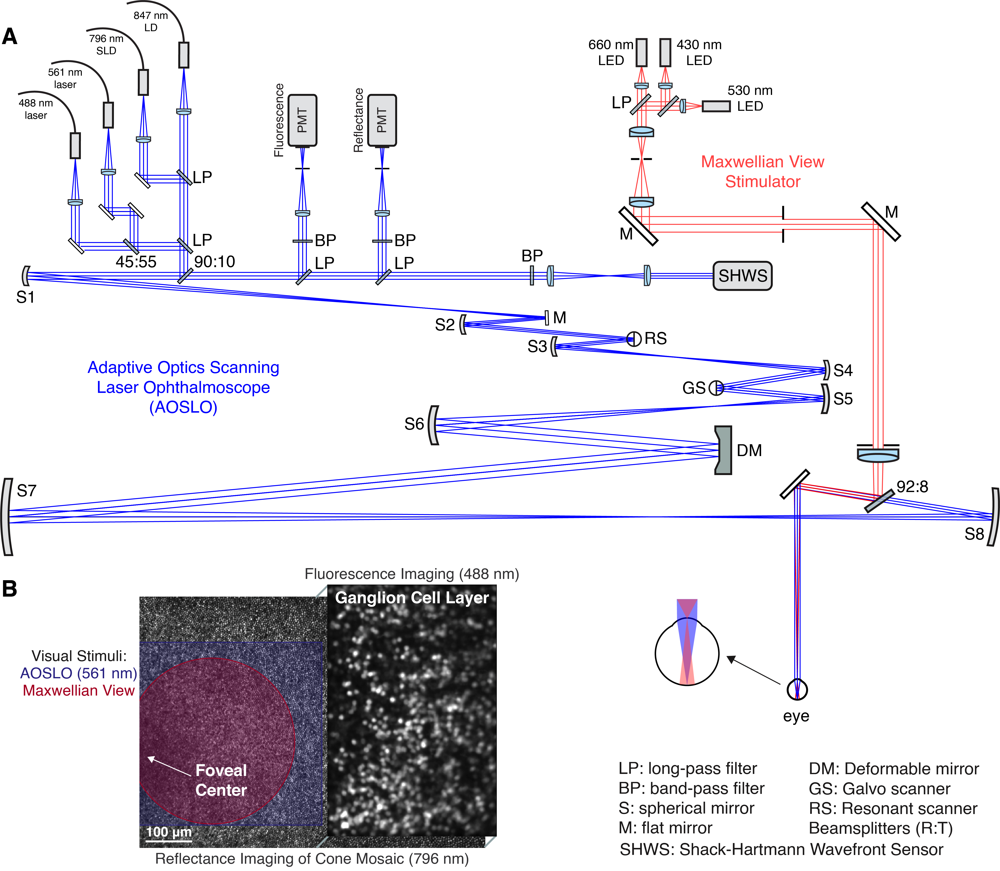

# PattersonLabDocs

A common location for storing protocols for the 1P AOSLO. May be useful to other systems.

__Operation Protocols__
- [System setup](SystemDocumentation.docx) - how to turn the system on/off, default software setup, overview on what everything is/does
- [PMT and Source Optimization](SystemDocumentation.docx) - day before each experiment
- Experiment Setup - to be added

__Alignment Protocols__ (see also [Alignment Checklist](AlignmentChecklist.md))
- [Source Arm Coalignment](Source_Arm_Alignment.md) - before a system alignment, to check whether an alignment is needed
- [System Alignment](AOSLO_Alignment.md) - every few months, after source arm alignment, as needed
- [Marmoset Relay Alignment](Marmoset_Relay_Alignment.md) - after system alignment and AO calibration. Can also be done independent of main AOSLO alignment
- [Maxwellian View Coalignment](MaxwellianViewAlignment.md) - any time the AOSLO has been realigned or you want to change the location of the Maxwellian View stimulus within the field of view.

__Calibration Protocols__
- [Power Measurements](PowerMeasurements.md) - before each experiment
- [AO Calibration](AO_Calibration.md) - after system alignment
- [Scanner Field of View Calibration](FieldOfView_Scanner_Calibration.md) - after system alignment
- [Spectra and Gamma Calibration](LED_Spectra_Gamma_Calibration.md) - every few months, any time the Maxwellian View subsystem is altered or the pellicle is removed.
- [Spectrometer Calibration](Spectrometer_Calibration.md) - any time you want to calibrate the LEDs and the collection optics of the spectrometer have changed (e.g., cosine corrector added/removed)
- [Marmoset Stereotax Base Rotation Alignment](Marmoset_Stereotax_Alignment.md) - if the stereotax base (562-XYZ and PY004 stages) is moved

__Infrequently Used Protocols__ (to be added)
- Detection Arm Alignment
- LED Subsystem Alignment

__Standard Analysis Protocols__
- [Calcium Imaging Registration](CalciumImagingRegistration.md)
- Online Pixelwise Analysis - to be added

### Resources
- [Alignment checklist](AlignmentChecklist.md) for a comprehensive AOSLO alignment
- [Map](img/1PLabLayout.pdf) of what needs to be turned on/off during system startup
- Simplified [system diagram](img/SystemFigure.png) designed to balance accuracy with clarity
- [LED calibration checklist](resources/LED_Calibration_Checklist.xlsx)
- Imaging experiment documents: [notes](resources/1P_NHP_imaging_notes_sara.pdf) and [coversheet](resources/1P_NHP_imaging_notes_coversheet.pdf)
- Excel spreadsheet for field of view scanner calibrations

